# DEFER-Dx

An interactive clinical diagnostic agent trained with reinforcement learning over four actions: **ASK, TEST, COMMIT, DEFER**. Deferring to a clinician is a learned action. Its reward is the **counterfactual escalation value (CEV)**: at the exact state where the agent escalates, forced continuations branched from that state estimate the clinical value of *not* escalating, by deciding now or investigating further. The DEFER turn is credited with the difference. The handoff is a probabilistic differential trained with a strictly proper scoring rule. The label space is open-world: the four MIMIC-CDM abdominal conditions plus **OTHER**.

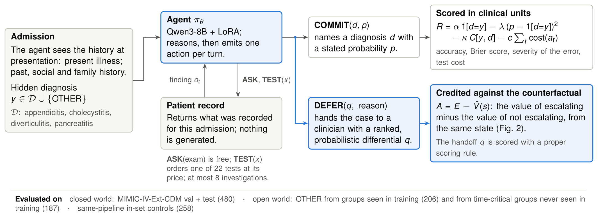

- Research plan: [stanford_idea_md.md](stanford_idea_md.md) (target: Stanford AI+HEALTH 2026 abstract, due Oct 15, 2026)
- The method as implemented, with every constant: [docs/METHODS.md](docs/METHODS.md)
- Paper draft: [docs/PAPER.md](docs/PAPER.md) · abstract scaffold: [docs/ABSTRACT.md](docs/ABSTRACT.md)
- Results: [docs/RESULTS.md](docs/RESULTS.md) (generated as evaluations finish) · all figures with captions: [§3](#3-results-and-figures), sources in [docs/figures/](docs/figures/)

> **PhysioNet DUA.** MIMIC text never reaches a third-party service. Every model runs on local weights (`transformers` / `vllm`), and the repo has no hosted-API clients. `.gitignore` excludes `data/`, `outputs/`, `.env`, `*.jsonl`, `*.csv*` and `*.pkl`. Rollout files contain MIMIC text, so treat them as credentialed data. Committed documents hold aggregates only, and patient-derived counts of 1–9 are suppressed. Weights trained on MIMIC are not pushed to public hubs; PhysioNet's credentialed hosting is the DUA-consistent release route.

---

## 1. Status (2026-10-08)

| Component | State |
|---|---|
| Data: MIMIC-IV-Ext-CDM 1.1, MIMIC-IV 2.2 hosp, MIMIC-IV-Note 2.2 | downloaded; SHA256 and gzip verified |
| Open-world set MIMIC-CDM-OW: 713 OTHER + 648 same-pipeline controls | built; deterministic (byte-identical rebuilds) |
| Patient-disjoint cohorts (`data/cohorts/`) | built |
| Single-GPU colocated GRPO trainer | built, tested and in use |
| Case-level group-consensus arm (`configs/grpo_deferdx.yaml`; the published mechanism, kept as a comparator) | trained (150 steps); held-out evaluation done |
| Zero-shot baselines (forced choice; prompted DEFER) | held-out evaluation done |
| **DEFER-Dx with the counterfactual escalation value** (`configs/grpo_cev.yaml`, the method) | The first run used a plain dual-ascent coverage cap. Its multiplier ran a limit cycle (Fig. 8) and deferral collapsed after each overshoot, so that run is kept as a comparison (`cev_dualascent`). The method is **retrained with a PI coverage controller** (`scripts/queue_v3.sh`, from Oct 8, about 23:00 IST; about 22 h), with held-out numbers around Oct 10. |
| GRPO control (no DEFER), the key comparator | queued after the method; around Oct 10 |
| Ablations of what is new (no scored handoff; constant deferral reward), robustness, gpt-oss-20b | queued (`scripts/queue_v3.sh`); through about Oct 12 |
| Figures | 13 publication figures in [docs/figures/](docs/figures/) (PDF, PNG, SVG; TikZ sources), shown in §3. The data figures regenerate with every report. |
| Tests | 109 pass (`pytest`; CPU only) |

Held-out numbers exist for the comparator arm and the zero-shot baselines ([docs/RESULTS.md](docs/RESULTS.md)). DEFER-Dx's are pending. Until they exist, the paired figure (Fig. 5) uses the comparator arm as its reference system.

## 2. Is it novel? Is it beating SOTA? (honest assessment)

### 2.1 Novelty

Three literature checks (2026-10-06 and 2026-10-07; details in [docs/RESEARCH.md](docs/RESEARCH.md) §7–9) found that the reward first built here was **already published**. Deferral rewarded by the policy's estimated case-level success rate γ(τ − p̂) is:
- **TIAR** (arXiv 2605.25850): identical at τ = 0.5;
- **KARL** (2604.22779): a binary variant;
- **AWA-RL** (2607.10738): the same idea in multi-turn agents, with a refusal-rate penalty;
- **TrustMed-RL** (2610.04387): RL-trained clinical deferral on designated cases.

The method was therefore redesigned around a quantity none of them uses.

**Counterfactual escalation value (CEV).** At the exact state where the agent escalates, K forced continuations are branched by replaying the environment, with escalation disabled and further tests allowed. Their mean clinical return V̂(s) (accuracy, proper score, severity, cost of further tests) is the value of *not* escalating there. The DEFER turn's advantage is E − V̂(s), where E includes a strictly proper score of the handed-over probabilistic differential.

| Closest work | What it does | Difference from CEV |
|---|---|---|
| TIAR, KARL, AWA-RL | Abstention reward from the policy's **case-level** success rate (group statistics or a prior checkpoint) | CEV is **state-level and counterfactual**: escalating versus continuing *from the same state*, so "another test would settle it" (escalation discouraged) is separated from "continuing would err" (escalation credited). Valued in clinical units: severity, calibration and workup cost. |
| TrustMed-RL | Deferral rewarded on cases designated by construction | No case is labelled "should defer"; the target is counterfactual and on-policy. |
| Tree / branched RL (Tree-GRPO, SIPO, Counterfactual Rollout Replay, ASCT); CDPR | Branching for generic step-level credit; CDPR scores investigative actions | None targets an **escalation** action or values it against continuation, and none has a handoff. |
| Signed Rescue Routing | Escalation value in model cascades, at inference time | CEV *trains* an agent's escalation, with on-policy counterfactuals. |
| Decide/Ask/Defer, Safe to Stop?, MedAbstain, MediQ | Evaluation, conformal stopping or prompting | Learned by RL. |
| — | (none found) | **The scored handoff:** deferral must hand over a probabilistic differential, rewarded with a strictly proper scoring rule. |

**Verdict.** To our knowledge, based on these searches, the CEV mechanism (state-level counterfactual escalation credit plus a properly scored handoff) is new, and so is MIMIC-CDM-OW, the open-world benchmark with never-seen time-critical diagnoses. Novelty against an open literature cannot be proven absolutely, so the plan re-checks within 72 hours of submission. The previously built consensus reward is kept only as a **comparator arm**: it is the published mechanism, and CEV must beat it.

### 2.2 SOTA

Published MIMIC-CDM numbers use different splits, metrics and environments, so only some comparisons are like-for-like. Rows marked "this protocol" are the held-out evaluation of this repository ([docs/RESULTS.md](docs/RESULTS.md) §1 and §4; 3 seeds, 95% bootstrap intervals). The closed-world zero-shot row comes from earlier runs ([docs/BASELINES.md](docs/BASELINES.md)); it is re-run under this protocol in the queue (`eval_zs_closed`).

| System | Split | Mean-class acc | Case-weighted acc | Diverticulitis | Selective acc (coverage), CDM val + test |
|---|---|---|---|---|---|
| LA-CDM, trained (ICLR 2026, reported) | LA-CDM test | 81.3 | – | 75.0 | – |
| LDTL (reported; current SOTA) | own unpublished 70/10/20 | – | **93.4** | 78.8 | – |
| Random planner (from LDTL) | own split | – | 84.8 | 90.4 | – |
| DiagAgent-14B (run here) | LA-CDM test | 71.9 | 77.9 | 56.0 | – |
| Qwen3-8B zero-shot, **closed world** (4 classes; earlier runs) | LA-CDM test | 87.2 ± 2.4 | 88.3 ± 1.1 | 84.8 (all 2,400 cases) | – |
| Qwen3-8B zero-shot, open world, forced choice (this protocol) | LA-CDM test | 74.4 (69.1–79.5) | 76.7 (72.2–81.1) | 76.0 (60.8–90.1) | 75.5 (98.4%) |
| Qwen3-8B zero-shot, open world, prompted DEFER (this protocol) | LA-CDM test | 78.3 (73.7–82.4) | 79.2 (75.1–83.1) | 82.7 (70.7–92.4) | 87.9 (75.1%) |
| Case-level consensus arm, open world (published mechanism; this protocol) | LA-CDM test | **86.3** (82.2–90.2) | 87.1 (83.5–90.6) | **90.7** (79.4–98.6) | **94.0** (82.6%) |
| **DEFER-Dx (CEV)**, open world | LA-CDM test | pending | pending | pending | pending |

**Verdict so far:**
- **Open world costs accuracy.** Offering OTHER as a fifth answer costs the untrained model about 13 points: 87.2 closed world against 74.4 open world on the same test split, because it answers OTHER on many in-set cases. Every trained system here works in the open world.
- **Above LA-CDM:** the trained comparator arm reaches 86.3 mean-class accuracy on LA-CDM's test split in the open world, against LA-CDM's 81.3 in its closed world. The environments differ (full history versus a summary, 22 tests versus 12, a different base model), so this is context, not a head-to-head.
- **Above LDTL on diverticulitis:** 90.7 versus 78.8, on a different split.
- **Below LDTL's 93.4 at full coverage:** the comparator's case-weighted 87.1 is the one SOTA number not reached, and LDTL's split is unpublished.
- **Selective target ("> 95 at 85% coverage"):** not met yet in the open world. The comparator arm reaches 94.0 at 82.6% coverage.
- **Undecided:** whether learned deferral beats thresholding is the central claim. It is decided only by the paired DEFER-Dx versus thresholded-GRPO-control comparison (around Oct 10).

The plan itself (§6.4) says not to claim SOTA on LDTL's full-coverage metric; the pitch is a Pareto improvement on safety axes nobody else reports.

## 3. Results and figures

**Held-out so far** (CDM val + test, 480 cases × 3 seeds; paired bootstrap on the same cases, [docs/RESULTS.md](docs/RESULTS.md) §5):
- **Against prompted deferral.** The trained consensus arm answers more cases than zero-shot prompted DEFER (coverage +7.5 points, 4.7–10.2). It is also more accurate on them (+6.1, 3.8–8.6) and makes fewer unflagged errors (−4.2, −6.0 to −2.3).
- **Against a threshold.** With a post-hoc threshold on the zero-shot model's stated probability, the comparison is not at matched coverage. Its stated probabilities tie, so the cross-fitted threshold lands at 92.6% coverage, not 82.6%. Compared with both systems under self-consistency over three samples, where agreement serves as the zero-shot model's confidence, coverage does match (−0.8 points, −5.0 to 3.3). The consensus arm is still +11.1 points (7.3–14.9) more accurate on answered cases.
- **DEFER-Dx.** The method's own comparisons, against the identically trained GRPO control with a threshold (the test of learned versus post-hoc deferral) and against this consensus arm, are pending. They fill Figs. 4–7 automatically.

**The figures.** Every figure is below, in paper order. Vector PDFs for the manuscript, SVG and 300-dpi PNG are in [docs/figures/](docs/figures/).
- **Data figures:** drawn by [scripts/make_figures.py](scripts/make_figures.py) from aggregates only (`docs/results.json`, numbers-only training logs). They are regenerated with every report, so they fill in as runs finish. A figure whose inputs don't exist yet shows a labelled placeholder.
- **Schematics:** TikZ, in [docs/figures/tikz/](docs/figures/tikz/), with shared styles in `deferdx-figures.sty`; build with `bash scripts/build_tikz.sh`.
- **Colour:** each system has one colour in every figure, and DEFER-Dx is always blue. Every series also has a label and its own marker.
- **Intervals:** all are 95% case-level bootstrap intervals (2,000 resamples).

**Figure 1 | DEFER-Dx.**
- **The episode:** one admission. The agent sees the history at presentation. Turn by turn it asks for the examination, orders one of 22 individual tests (each charged at its price, at most 8 investigations), commits to a diagnosis with a stated probability, or defers to a clinician with a ranked, probabilistic differential.
- **Scoring:** a commitment is scored in clinical units: accuracy, Brier score, severity of the error and test cost. A deferral is credited against the counterfactual of not deferring (Fig. 2).
- **Label space:** open, the four MIMIC-CDM conditions or OTHER.


**Figure 2 | The counterfactual escalation value.**
- **Branching:** when an episode ends in DEFER at state *s*, the environment is replayed to *s*. K = 3 forced continuations are sampled in which escalation is disabled (a DEFER executes as COMMIT of the differential's top) and further tests stay allowed.
- **Credit:** their mean clinical return *V̂(s)* is the value of not escalating from *s*. The DEFER turn's advantage is *A = E − V̂(s)*, where *E* values the escalation itself, including a strictly proper score of the handed-over differential.
- **Effect:** escalation is credited where continuing would err, and discouraged where another test would settle the case.

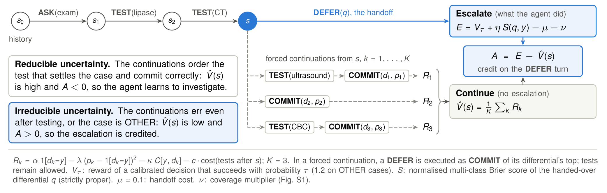

**Figure 3 | Data and evaluation design.** Two sources, patient-disjoint cohorts, and what is measured. MIMIC-CDM-OW, built here with MIMIC-CDM's own text pipeline, supplies the OTHER cases and same-pipeline in-set controls. The five time-critical OTHER groups are held out of training entirely.

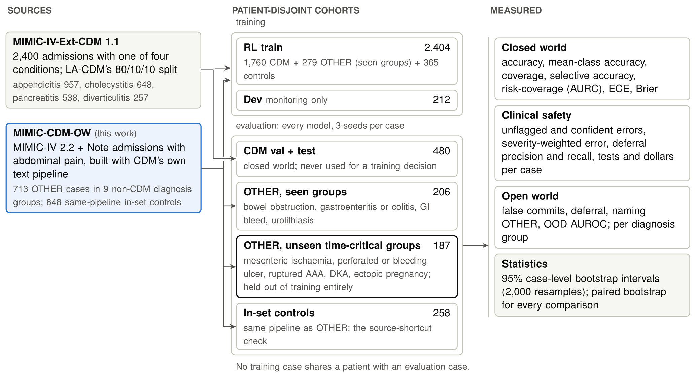

**Figure 4 | Risk–coverage on CDM val + test.**
- **a:** accuracy on answered in-set cases as the stated-probability threshold is lowered. Each curve ends (filled marker) at the system's own coverage, because a deferral never counts as answered. Hollow markers are forced-choice systems with a post-hoc threshold cross-fitted at the reference system's coverage (vertical line).
- **b:** area under the risk–coverage curve (lower is better).

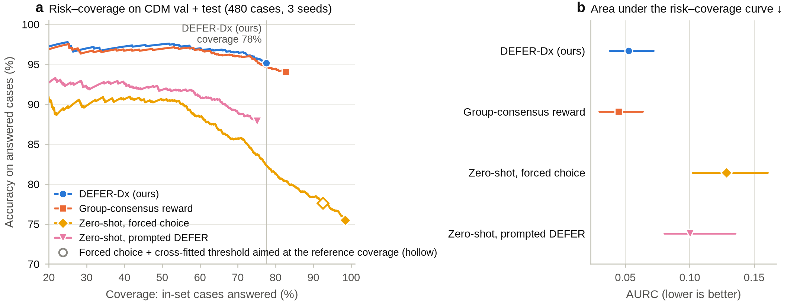

**Figure 5 | Paired differences on the same cases.**
- **Panels:** each compares the reference system (DEFER-Dx once evaluated; until then the consensus arm) with one comparator.
- **Points:** paired bootstrap differences in percentage points (AURC and ECE × 100). They are oriented so that positive values favour the reference system: the sign is flipped for lower-is-better metrics (↓). Filled points have an interval that excludes 0.

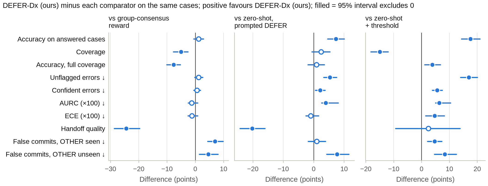

**Figure 6 | Clinical safety on CDM val + test.**
- **a:** unflagged errors, wrong commitments per case.
- **b:** confident errors, wrong commitments stated with p > 0.8.
- **c:** severity-weighted error, from the time-to-harm severity matrix.
- **d:** tests ordered per case.

Hollow markers: forced choice with a post-hoc threshold at matched coverage.

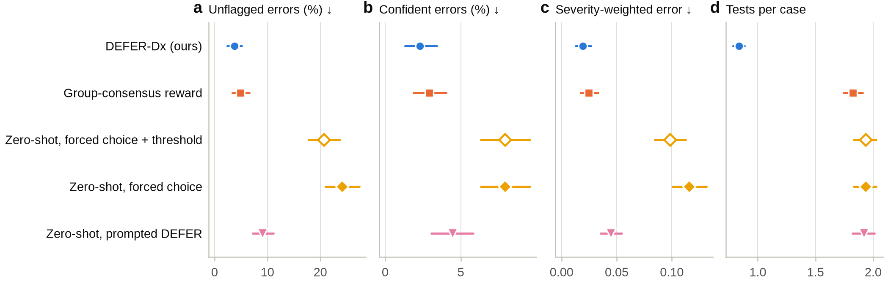

**Figure 7 | Open world.** Outcomes on OTHER cases from (a) diagnosis groups seen in training and (b) five time-critical groups never seen in training. The four outcomes are a false commitment to one of the four conditions, a confident false commitment (p > 0.8), deferral to a clinician, and naming OTHER.

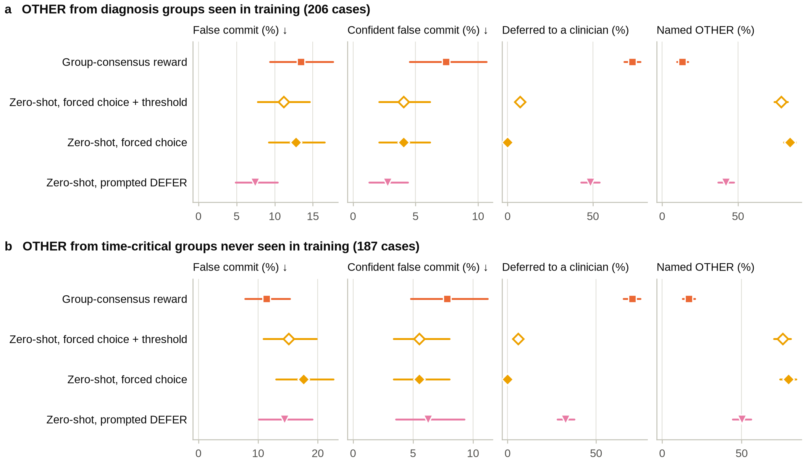

**Figure 8 | Training dynamics and the coverage controller.**
- **Panels:** (a) coverage multiplier ν; (b) in-set deferral rate in training batches (5-step mean) against the 30% cap; (c) out-of-set deferral rate; (d) in-set coverage on the 212-case dev set at each evaluation.
- **Dual ascent:** with plain dual ascent, ν wound up while the policy lagged, and in-set deferral collapsed after each overshoot: a limit cycle. Dev coverage then depended on where an evaluation fell in the cycle.
- **PI controller:** the method is trained with a PI controller instead (Fig. S1). The consensus arm's cap barely bound.

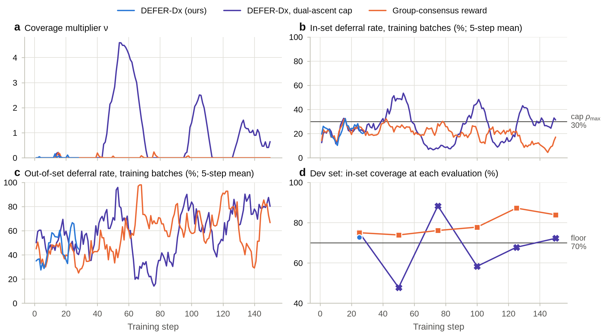

**Figure S1 | One training step.** Multi-turn GRPO with the counterfactual escalation value, and the PI controller that holds in-set deferral at or below the cap.

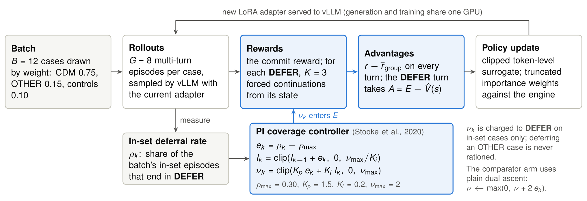

**Figure S2 | Reliability of stated probabilities** on committed CDM val + test cases. Only bins with at least 10 commitments are drawn, and the diagonal is perfect calibration. ECE is shown with its 95% interval.

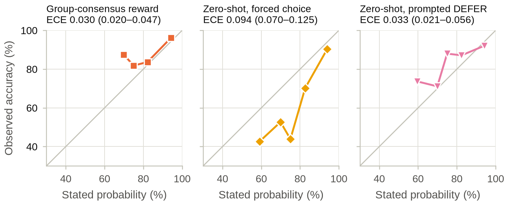

**Figure S3 | Accuracy at full coverage by condition**, CDM val + test. A deferral counts through the top of its differential.

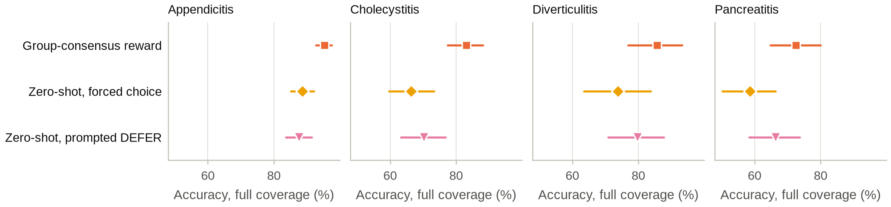

**Figure S4 | Unseen time-critical OTHER groups.** False commitments and deferral by diagnosis group, for groups with at least 10 cases. Ruptured AAA and ectopic pregnancy have fewer and are suppressed under the small-cell rule.

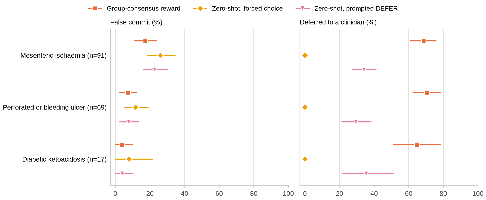

**Figure S5 | Ablations at 100 training steps.** DEFER-Dx against the same training without the scored handoff (η = 0), and with a constant deferral reward. Written when the ablations finish.

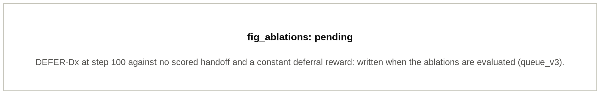

## 4. Method in brief

- **Actions.** `ASK(physical_exam)`; `TEST(x)` for 22 individual tests (CBC, CMP, lipase, CT abdomen, …) at 2025 BIDMC charges; `COMMIT(d, p)` with d ∈ {4 conditions, OTHER} and stated probability p; `DEFER(differential, reason)`. At most 8 investigations. The full history is shown at reset.
- **Commit reward:** α·1[d = y] − λ(p − 1[d = y])² − κ·C[y, d] − c·Σcost, with α = 1, λ = 1 (Brier), κ = 0.5, C the severity matrix, and c = 1/Σ(catalog prices).
- **Escalation (CEV):** the DEFER turn's advantage is E − V̂(s).
  - V̂(s) is the mean clinical return of K = 3 forced continuations from the same state (no escalation; tests allowed).
  - E = V_τ (OTHER: 1.2) + η·S(handoff) − μ − ν, with S the normalised Brier score of the handed-over differential, η = 0.3, μ = 0.1.
  - τ is annealed 0.95 → 0.85.
- **Comparator arm (published mechanism):** a case-level reward γ(τ − p̂) − μ, with p̂ the group's commit accuracy.
- **Coverage constraint:** in-set deferral ≤ 30%; ν is charged to deferring rollouts only. Projected dual ascent for the comparator; a PI Lagrangian (K_p 1.5, K_i 0.2, ν ≤ 2) for the escalation-value arms, where plain dual ascent wound up and collapsed deferral.
- **Training:** multi-turn GRPO, B = 12 cases × G = 8.
  - Dr. GRPO advantages (r − mean, no std division); groups with reward spread < 0.05 are skipped.
  - Clip-higher (0.2 / 0.28), DAPO token-level loss, no KL.
  - LoRA r = 16 / α = 32 on all linear layers; temperature 1.0 rollouts.

## 5. Decisions made during the build, and why

1. **Colocated vLLM + PEFT trainer** (`training/grpo_vllm.py`), replacing the HF-generate GRPO reference loop, which was too slow for multi-turn RL on one GPU.
   - **How it works:** vLLM samples with the current LoRA while the frozen weights wait in pinned CPU memory; vLLM then sleeps and PEFT trains.
   - **Checked:** vLLM's LoRA log-probs match HF+PEFT within bf16 noise across sleep/wake cycles (mean |Δ log p| 0.024–0.030 per token, against a LoRA effect of 0.45).
2. **Truncated importance sampling** against vLLM's own token log-probs: the engines differ by about 0.02 nats per token.
3. **Memory and speed of the training pass.**
   - **Memory:** a custom frozen-head log-prob autograd function recomputes logits chunk by chunk in the backward pass (gradient-checked), so memory doesn't scale with the 152k vocabulary.
   - **Speed:** one unpadded sequence per micro-batch is 1.55× faster than padded batches (benchmarked: 1,945 vs 1,259 tokens/s).
4. **Learning-rate schedule (all runs inherit it).** Steps 1–25 at 1e-5, then 5e-5 (`lr_milestones`). After 25 steps at 1e-5 the adapter had moved the weights by only 1.3 × 10⁻⁴ of their norm and metrics were flat.
5. **PPO mini-batches (all runs inherit it).** One optimizer step per rollout batch up to step 50, then 4 PPO mini-batches against vLLM's behaviour log-probs (`ppo_minibatch_milestones`). At step 50 the update was still only 6 × 10⁻⁴ of the weights' norm. This is what produced the step-75 gains in §3.
6. **Checkpoints every 5 steps** (multiples of 25 kept). The machine rebooted at step 86; the run resumed from step 75.
7. **Constant-deferral-reward ablation replaces the no-constraint ablation.**
   - The constraint never bound, so a no-constraint run would replicate the main one.
   - The constant arm matches the consensus reward's operating point (0.503 → 0.412 over the τ curriculum), so it isolates the value of the consensus signal itself.
8. **Open-world set made deterministic.** Its SQL row order was not total, so tied lab results resolved differently between builds: 21 of 713 OTHER cases differed between two builds. It is now byte-identical across rebuilds.
9. **`build-openworld --n 2400` is the default.** It samples before its drop rules: `--n 800` yields 259 OTHER cases, not 713.
10. **Cohorts are patient-disjoint.**
    - The time-critical OTHER groups are held out of training entirely.
    - Same-pipeline controls are in training, so "open-world pipeline ⇒ OTHER" cannot be learned.
    - Cases are drawn from source pools by weight (CDM 0.75 / OTHER 0.15 / controls 0.10).

11. **Redesigned the deferral reward for novelty (2026-10-07).**
    - The case-level group-consensus reward turned out to be published: TIAR is identical at τ = 0.5; KARL and AWA-RL are close variants.
    - It was replaced as the method by the counterfactual escalation value with a scored handoff (`configs/grpo_cev.yaml`, `rollout.branch_rollouts`, `training.grpo_vllm.turn_advantages`).
    - The running consensus run became a comparator arm.
    - Ablations now isolate the new parts: no scored handoff, and a constant reward.

### Departures from the original plan

1. **The coverage penalty applies to deferring rollouts only.** A constant subtracted from a whole GRPO group cancels in the advantage.
2. **The open-world DEFER reward is 1.2, not 1.1.** After the handoff cost μ = 0.1, 1.1 would exactly tie a perfect COMMIT(OTHER).
3. **τ is not the effective threshold.** τ = 0.85 means defer below a success estimate of about 0.645; report both numbers.
4. **p̂ with no commits in the group is "neutral" (= τ).** Setting it to "zero" would reward all-defer groups.
5. **There are two "Mean Acc" conventions.**
   - LA-CDM uses the per-class mean; LDTL's own rows are case-weighted.
   - Both are reported (`accuracy_full_coverage`, `mean_class_accuracy`).
   - The plan's "93.4 vs 81.3" crosses both metrics and splits.
6. **Full-coverage accuracy for DEFER** counts the top of the deferral differential.
7. **RL samples are per turn.** Qwen3's template strips earlier `<think>` blocks.
8. **ASK covers the physical exam only, and the full history is shown at reset**, as in LA-CDM and LDTL.
9. **Evaluation samples** at T 0.6, top-p 0.95, top-k 20, as Qwen3 recommends; it never decodes greedily.
10. **No SFT stage.** The base model already uses DEFER when it's offered (25% of CDM cases zero-shot), so RL starts from it directly.
11. **The LDTL "official 70/10/20 split" doesn't exist.** The exact LA-CDM 80/10/10 split is used, and val + test are pooled for power (cross-fitted thresholds).

## 6. Evaluation protocol

- **Sets:**
  - CDM val + test (480; never used in training);
  - OTHER from seen groups (206) and from unseen, time-critical groups (187);
  - same-pipeline controls (258).
  - 3 seeds each, with reproducible per-request seeds.
- **Baselines, all run here on the same cases:**
  - zero-shot Qwen3-8B, forced choice and with prompted DEFER;
  - the GRPO control;
  - post-hoc thresholds at DEFER-Dx's coverage (cross-fitted: fit on val, applied to test and vice versa);
  - SGR (5% risk, δ 0.05);
  - self-consistency over 3 samples;
  - gpt-oss-20b;
  - DiagAgent-14B and the published LA-CDM / LDTL numbers as context.
- **Machine-learning metrics:** accuracy at full coverage, mean-class accuracy, macro-F1, coverage, selective accuracy, AURC, accuracy at 70/80/90% coverage, ECE, Brier, OOD AUROC.
- **Clinical metrics:**
  - per-class accuracy (diverticulitis);
  - unflagged errors and confident errors (p > 0.8);
  - severity-weighted error;
  - false commits on never-seen, time-critical diagnoses, overall and per diagnosis group (groups ≥ 10 cases);
  - deferral precision and recall;
  - tests and dollars per case.
- **Statistics:** 95% case-level bootstrap intervals; paired bootstrap differences on the same cases.
- **Robustness:**
  - every sentence containing CDM's `____` diagnosis mask removed;
  - same-pipeline controls (source shortcut);
  - closed-world zero-shot, as in prior work.

## 7. Reproduce

```bash
pip install -e ".[train,data,dev]"        # CPU tools + tests: pytest
# GPU stack (one 48 GB GPU; Python 3.12): torch, vllm, transformers, peft in .venv-gpu
uv venv --python 3.12 .venv-gpu && uv pip install --python .venv-gpu/bin/python vllm -e ".[train,data,dev]"
source scripts/env_gpu.sh                 # reads only the HF token from .env; caches in .cache/ (git-ignored)

# Data (credentialed). Interactive prompt; resumes and checks PhysioNet SHA256SUMS:
bash scripts/download_physionet_interactive.sh cdm hosp note
bash scripts/verify_physionet_downloads.sh
deferdx data build-cdm --cdm-dir data/physionet/mimic-iv-ext-cdm/1.1 --out data/cdm      # exact LA-CDM split
deferdx data build-openworld --mimic-dir data/physionet/mimiciv/2.2 --note-dir data/physionet/mimic-iv-note/2.2 \
    --exclude-cases data/cdm/all.jsonl --controls --controls-per-label 3000 --n 2400 --out data/openworld_xl
deferdx data cohorts                      # -> data/cohorts/*.jsonl + manifest.json

# Everything else runs through one idempotent queue (waits for a free GPU; resumes after crashes or reboots):
setsid nohup bash scripts/queue_v3.sh >> outputs/logs/queue_v3.log 2>&1 &

# Single pieces:
deferdx train grpo-vllm --config configs/grpo_cev.yaml            # DEFER-Dx, counterfactual escalation (the method)
deferdx train grpo-vllm --config configs/grpo_deferdx.yaml         # case-level consensus comparator arm
deferdx train grpo-vllm --config configs/grpo_nodefer.yaml         # control
deferdx eval-suite --model Qwen/Qwen3-8B --adapter outputs/runs/deferdx/final --name deferdx
python scripts/make_report.py              # docs/RESULTS.md, docs/results.json and the data figures in docs/figures/
bash scripts/build_tikz.sh                 # the TikZ schematics (pdflatex with tikz, standalone, sansmath)
python scripts/plot_training.py --runs deferdx=outputs/runs/deferdx nodefer=outputs/runs/nodefer
deferdx crossover                                                   # tau -> effective deferral threshold
```

**Keeping GitHub and the Hugging Face Hub in sync** (a CPU-only process alongside the queue):
```bash
setsid nohup python scripts/sync_daemon.py --interval 900 >> outputs/logs/sync.log 2>&1 &
python scripts/push_hf.py --run cev          # or push one run by hand
```
- **GitHub:** every 15 minutes the regenerated, aggregate-only results (`docs/RESULTS.md`, `docs/results.json`, `docs/figures/`) are committed and pushed to `main`. An allow-list means nothing else can be staged.
- **Hugging Face:** each finished run's LoRA adapter goes to a **private** model repo under the account of the `hf` token in `.env`, with a model card (provenance, DUA status, intended use, held-out metrics) and the numbers-only training log. Cards refresh whenever results change.
- **Why private:** the weights derive from PhysioNet credentialed data, so a public release belongs on PhysioNet's credentialed channel. Rollouts, cases and MIMIC text are never uploaded.

| Run | Hugging Face repo (private) |
|---|---|
| Comparator (case-level consensus) | `GOVINDFROM/deferdx-consensus-qwen3-8b-lora` |
| DEFER-Dx (counterfactual escalation) | `GOVINDFROM/deferdx-cev-qwen3-8b-lora` (when trained); the first, dual-ascent run's checkpoints are on its `dual-ascent-*` branches |
| No-defer control | `GOVINDFROM/deferdx-nodefer-control-qwen3-8b-lora` (when trained) |
| Ablations | `GOVINDFROM/deferdx-abl-*-qwen3-8b-lora` (when trained) |

**After a reboot,** relaunch the queue command and the sync command above. Steps marked done in `outputs/queue/*.done` are skipped, and training resumes from its newest checkpoint (one is saved every 5 steps).

**Synthetic smoke tests (no MIMIC data):** `bash scripts/smoke_synthetic.sh`; `deferdx data synth`.

## 8. Layout

| Path | What it does |
|---|---|
| [src/deferdx/data/](src/deferdx/data/) | CDM loader (earliest value per repeated test), open-world builder (DuckDB; CDM-parity text pipeline in `parity.py`), patient-disjoint cohorts (`cohorts.py`), LA-CDM split, synthetic cases |
| [src/deferdx/env/](src/deferdx/env/) | Reveal-on-request POMDP; 22-test catalog matched by MIMIC itemid; action parser; `mask_policy` for the `____` cue |
| [src/deferdx/rewards/](src/deferdx/rewards/) | Commit reward, group-consensus deferral reward (`p_hat_mode`, `defer_mode`), crossover analysis, coverage constraint |
| [src/deferdx/policy/](src/deferdx/policy/) | Local vLLM (LoRA hot-swap, per-request seeds, token log-probs) and HF policies; scripted oracle/random |
| [src/deferdx/training/grpo_vllm.py](src/deferdx/training/grpo_vllm.py) | Colocated GRPO: sleep/wake, frozen-weight parking, PPO mini-batches, truncated IS, LR and mini-batch milestones, OOM split-and-retry, checkpoint/resume |
| [src/deferdx/training/common.py](src/deferdx/training/common.py) | Frozen-head log-prob autograd function, token-budget micro-batching |
| [src/deferdx/eval/](src/deferdx/eval/) | Metrics; evaluation suites; bootstrap statistics and clinical metrics; self-consistency; cross-fitted post-hoc thresholds; per-group tables |
| [src/deferdx/baselines/](src/deferdx/baselines/) | Post-hoc threshold and SGR |
| [configs/](configs/) | Environment, reward, catalog, severity matrix, ICD lists; `grpo_deferdx.yaml`, `grpo_nodefer.yaml`, `ablations/` |
| [scripts/](scripts/) | Queues, report, figures, training plots, data audit, downloads, Lambda baseline jobs |
| [docs/figures/](docs/figures/) | Publication figures (PDF, SVG, PNG); TikZ sources and shared styles in `tikz/` |
| [tests/](tests/) | 109 CPU tests (`pytest`) |

## 9. Documents

| Doc | What it holds |
|---|---|
| [docs/METHODS.md](docs/METHODS.md) | Environment, reward with constants, cohorts, training, evaluation protocol |
| [docs/RESULTS.md](docs/RESULTS.md) | ML-benchmark and clinical tables with intervals, open world, published context, paired tests (generated) |
| [docs/figures/](docs/figures/) | All figures; captions in §3 of this README |
| [docs/EXPERIMENTS.md](docs/EXPERIMENTS.md) | The run grid, queues, ablations and the question each answers |
| [docs/PAPER.md](docs/PAPER.md), [docs/ABSTRACT.md](docs/ABSTRACT.md) | Paper draft and abstract scaffold (placeholders until results) |
| [docs/RESEARCH.md](docs/RESEARCH.md) | Facts checked against primary sources; literature re-checks and the narrowed novelty claim |
| [docs/DATA_AUDIT.md](docs/DATA_AUDIT.md) | Inventory, schemas, label and leakage checks, bias analysis |
| [docs/BENCHMARKS.md](docs/BENCHMARKS.md) | Metrics and best published results per component |
| [docs/BASELINES.md](docs/BASELINES.md) | Earlier inference-only baselines (Lambda A100 runs) |

## 10. Checked vs. still to verify

**Resolved:**
- **The dataset:** CDM v1.1 files, columns and labels (`pathology_ids.json`); no official split exists, so LA-CDM's split is reproduced exactly; CDM's text pipeline and inclusion rule, replicated for the open world; BIDMC costs for the panels and imaging.
- **Catalog coverage:** the core panels resolve for ≥ 99.8% of cases; `hida_scan` never resolves (CDM has no HIDA reports). Urine blood, bacteria and yeast are never reachable, a faithful copy of Hager's urinalysis panel.
- **Source shortcut:** a classifier separates same-pipeline controls from CDM cases only weakly (AUROC 0.563); the physical exam alone reaches 0.673.

**Still to verify:**
- **Placeholder costs:** tests marked `cost_source: placeholder` need real prices.
- **The severity matrix** is a time-to-harm proxy; it needs a clinician-built version.
- **Clinician review** of the ICD lists and sanitize terms.
- **Clinician adjudication** of deferrals (plan §6.3).
- **Informative test availability:** a test's existence can hint at the diagnosis. Report `charge_unavailable` both ways.

## 11. Limitations and not built yet

- **Scope:** single centre (BIDMC), abdominal pain only; proxy labels (principal ICD for OTHER).
- **Statistics:** 51 diverticulitis cases in val + test; one training seed per arm until the seed replicate finishes.
- **Not run:**
  - **MedGemma-27B:** gated; the configured HF account has not accepted its terms.
  - **LA-CDM re-run:** its repo has no released weights.
  - **The MIMIC-IV-ED triage variant, a Med-PRM verifier, a multi-GPU/verl port.**
